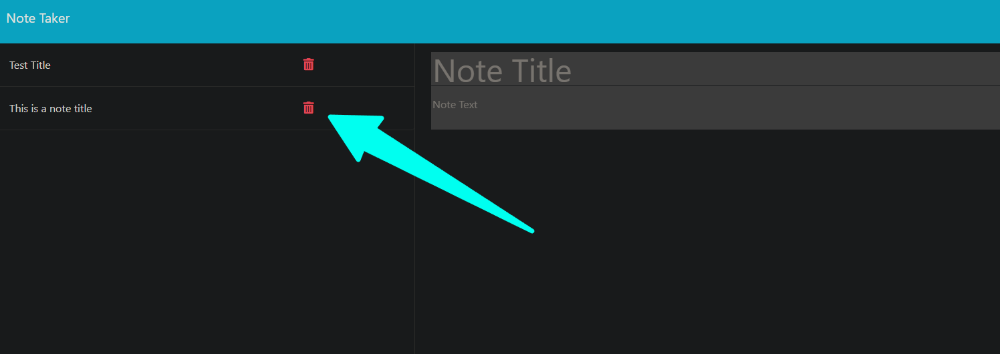

# Note Taker

## Table of Contents
- [Description](#description)
- [Installation](#installation)
- [Usage](#usage)
- [Credits](#credits)

## Description
The goal for this app was to make adjustments to the starter 	code to create an application (Note  Takedr) . This app can be used to write and save notes.

## User Story
AS A small business owner
I WANT to be able to write and save notes
SO THAT I can organize my thoughts and keep track of tasks I need to complete

## Installation
Express installed via terminal in VS Code. 

## Usage
Link to [Deployed Page via Heroku]().
 The note taker landing page should appear and you can click Get Started. 

 You can enter the note title and note text and the option to save or clear form will appear. Saved notes will appear on the left side of screen. 
 
 
 Clicking the trashcan icon will delete the saved note.

# Credits
[Link to starter code for this app](https://github.com/coding-boot-camp/miniature-eureka)